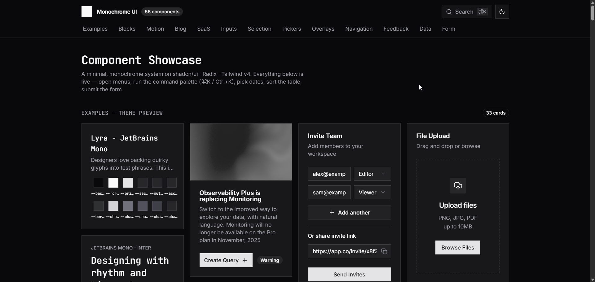

# My Design System

A minimal, monochrome design system I will use for future projects — built on
**shadcn/ui** (Radix primitives), **Tailwind v4**, **Vite**, and
**React 19 / TypeScript**. Squared corners, JetBrains Mono headings, a
grayscale palette, light + dark themes, and motion throughout.

**🔗 Live demo: https://danlitvak.github.io/design-system/**



---

## Highlights

- **56 UI components** — the full shadcn/ui set (buttons, inputs, dialogs,
  menus, tables, charts, calendar, command palette, and more).
- **33 example cards** — the shadcn theme-preview gallery, in the Lyra style.
- **13 composed blocks** — hero, navbar + mobile menu, footer, project grid,
  pricing, FAQ, auth forms, dashboard shell, contact form, and a blog/article
  layout with prose typography and a table of contents.
- **Motion primitives** — `FadeIn`, `Reveal`, `Stagger`, `AnimatedCounter`,
  and `Marquee`, powered by framer-motion. Reveal-on-scroll throughout.
- **Theming from one file** — every color, radius, and font is a CSS variable
  in `src/index.css`. Light + dark, plus a `ModeToggle` (light / dark / system).
- **Framework-ready** — components ship with `"use client"`; drops into
  Next.js App Router. See [`NEXTJS.md`](./NEXTJS.md).

## Tech stack

React 19 · TypeScript · Vite · Tailwind CSS v4 · shadcn/ui · Radix UI ·
framer-motion · next-themes · lucide-react · recharts

## Getting started

```bash
npm install
npm run dev      # start the dev server (Vite prints the local URL)
npm run build    # type-check + production build to dist/
npm run preview  # preview the production build locally
```

Requires Node 18+.

## Theming

Open `src/index.css`. The `:root` block is the light theme and `.dark` is dark;
both come from the **radix-lyra** preset (zinc-toned monochrome, `--radius: 0`,
JetBrains Mono headings). Change a token once and every component updates:

```css
:root {
  --radius: 0;
  --primary: oklch(0.21 0.006 285.885);
  --background: oklch(1 0 0);
  /* …colors, charts, fonts… */
}
```

Wrap your app in the `ThemeProvider` and drop a `<ModeToggle />` anywhere for a
light / dark / system switch.

## Project structure

```
src/
  components/
    ui/          56 shadcn/ui components
    blocks/      hero, navbar, footer, pricing, faq, auth, dashboard, …
    motion/      framer-motion primitives
    preview/     the shadcn example-card gallery
    theme/        ThemeProvider + ModeToggle
  lib/utils.ts   cn() helper
  hooks/         use-mobile, …
  index.css      design tokens (edit here to retheme)
  App.tsx        the live showcase
```

## Use it in your own project

Copy `src/components/`, `src/lib/utils.ts`, `src/hooks/`, and the token blocks
from `src/index.css` into your app, set the `@/*` path alias, and install the
dependencies above. For Next.js specifics (layout, server vs client, fonts),
see [`NEXTJS.md`](./NEXTJS.md).

## Deploy a live preview (GitHub Pages)

This repo includes a GitHub Actions workflow (`.github/workflows/deploy.yml`)
that builds and publishes to GitHub Pages on every push to `main`.

1. Push the repo to GitHub.
2. **Settings → Pages → Build and deployment → Source → "GitHub Actions".**
3. Push (or re-run the workflow); the live URL appears in the Pages settings.

The Vite `base` is set to `/design-system/` to match the repo name — update it
in `vite.config.ts` (or set `VITE_BASE`) if you rename the repo.

## License

MIT — use it freely in personal and commercial projects.
